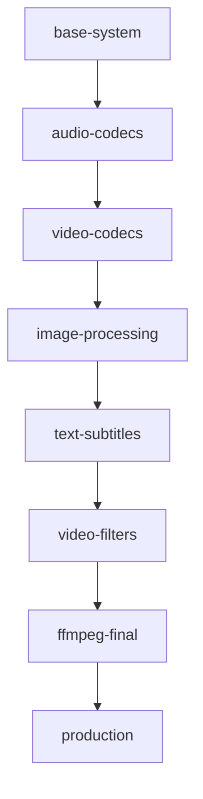

# FFmpeg Logical Build Stages

## 🏗️ **Smart Caching by Dependency Types**

Instead of time-based stages, we organize by **logical dependency groups** for maximum caching efficiency.

## 📊 **Stage Architecture**



### 🎯 **Stage Breakdown**

| Stage | Components | When to Rebuild |
|-------|------------|-----------------|
| **base-system** | System deps, zlib, iconv | Almost never |
| **audio-codecs** | LAME, Opus, Vorbis, FLAC | Audio format updates |
| **video-codecs** | x264, x265, VP8/9, AV1 | Video codec updates |
| **image-processing** | WebP, JPEG2000 | Image format needs |
| **text-subtitles** | FreeType, FontConfig, ASS | Subtitle features |
| **video-filters** | vid.stab, zimg | Filter/utility updates |
| **ffmpeg-final** | FFmpeg build | Config changes |
| **production** | Minimal runtime image | Deployment |

## 🚀 **Development Workflows**

### **🎵 Audio Development**
```bash
# Working on audio codecs? Rebuild from audio stage
docker build --target audio-codecs -t ffmpeg-audio .
docker build --target ffmpeg-final -t ffmpeg-dev .
```

### **🎬 Video Development** 
```bash
# New video codec? Rebuild from video stage
docker build --target video-codecs -t ffmpeg-video .
docker build --target ffmpeg-final -t ffmpeg-dev .
```

### **🔧 FFmpeg Config Changes**
```bash
# Only FFmpeg config changed? Rebuild final stage only
docker build --target ffmpeg-final -t ffmpeg-dev .
```

### **📦 Production Build**
```bash
# Full optimized build for deployment
docker build --target production -t ffmpeg-prod .
```

## ⚡ **Caching Benefits**

### **Scenario 1: Audio Codec Update**
```bash
# Before: Rebuild everything (2+ hours)
# After: Rebuild from audio-codecs (45 minutes)
```

### **Scenario 2: FFmpeg Flag Change**
```bash
# Before: Rebuild everything (2+ hours)  
# After: Rebuild ffmpeg-final only (15 minutes)
```

### **Scenario 3: New Video Filter**
```bash
# Before: Rebuild everything (2+ hours)
# After: Rebuild from video-filters (20 minutes)
```

## 🛠️ **Usage Examples**

### **Debug Specific Component**
```bash
# Debug audio issues
docker build --target audio-codecs -t debug-audio .
docker run -it debug-audio bash

# Debug video encoding
docker build --target video-codecs -t debug-video .
docker run -it debug-video bash
```

### **Test Incremental Changes**
```bash
# Test without text/subtitle support
docker build --target image-processing -t ffmpeg-basic .

# Test with all features
docker build --target ffmpeg-final -t ffmpeg-full .
```

### **CI/CD Optimization**
```yaml
# GitHub Actions example
- name: Build dependencies
  uses: docker/build-push-action@v5
  with:
    target: video-filters
    cache-from: type=gha
    cache-to: type=gha,mode=max

- name: Build FFmpeg  
  uses: docker/build-push-action@v5
  with:
    target: ffmpeg-final
    cache-from: type=gha
```

## 📈 **Cache Efficiency**

### **Layer Reuse Matrix**

| Change Type | Cached Stages | Rebuild Stages | Time Saved |
|-------------|---------------|----------------|------------|
| System packages | - | All | 0% |
| Audio codec | base-system | audio+ | 70% |
| Video codec | base+audio | video+ | 50% |
| FFmpeg config | base→filters | ffmpeg-final | 85% |
| Production | base→ffmpeg | production | 95% |

### **Practical Examples**

```bash
# Update LAME version
# ✅ Cached: base-system  
# 🔄 Rebuild: audio-codecs, video-codecs, image-processing, text-subtitles, video-filters, ffmpeg-final

# Add new FFmpeg encoder
# ✅ Cached: base-system → video-filters
# 🔄 Rebuild: ffmpeg-final only

# Update x264
# ✅ Cached: base-system, audio-codecs
# 🔄 Rebuild: video-codecs → ffmpeg-final
```

## 🎯 **Best Practices**

### **Development**
1. **Work incrementally** - change one component type at a time
2. **Use specific targets** - build only what you need
3. **Test stages independently** - validate before full build

### **Production**
1. **Use production target** - minimal final image
2. **Enable caching** - Docker layer caching or registry cache
3. **Tag strategically** - separate dev/prod tags

### **CI/CD**
1. **Cache aggressively** - use GitHub Actions cache
2. **Build incrementally** - don't rebuild unchanged stages  
3. **Parallel stages** - build independent components in parallel

## 🔍 **Monitoring & Debugging**

### **Check Stage Status**
```bash
# Check what's built in each stage
docker run --rm ffmpeg-audio ls -la /opt/ffmpeg/lib/
docker run --rm ffmpeg-video ls -la /opt/ffmpeg/lib/
```

### **Debug Failed Stage**
```bash
# Build up to failed stage
docker build --target video-codecs -t debug .

# Inspect the stage
docker run -it debug bash
cd /opt/ffmpeg/source
ls -la
```

### **Cache Analysis**
```bash
# Show Docker build cache usage
docker system df

# Show layer sizes
docker history ffmpeg-final
```

This logical approach makes development **much more efficient** - you only rebuild what actually changed! 